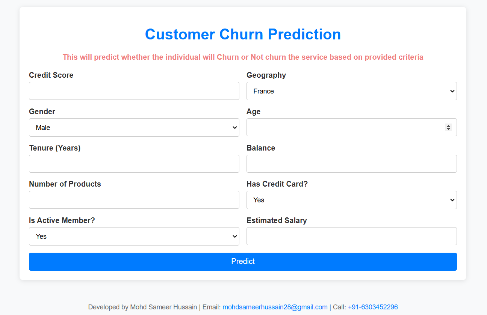
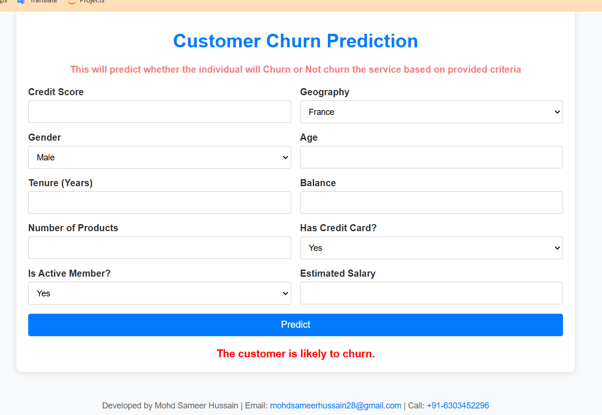
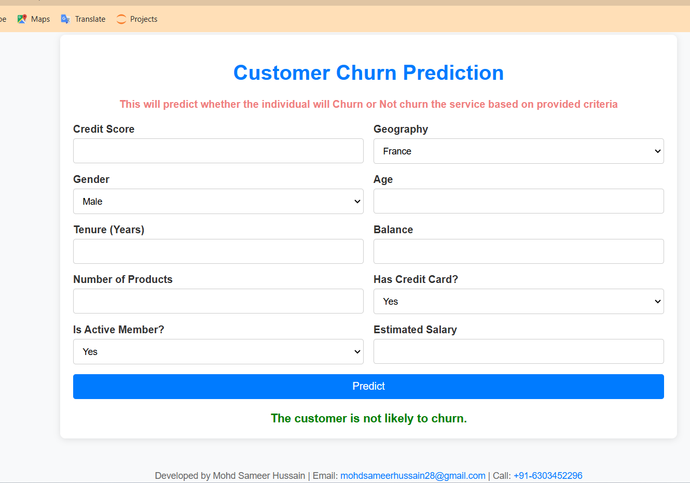

# Customer-Churn-Prediction-WebApp

A predictive model and web application for identifying potential customer churn or not. For more details, check the **Readme.md** file.

---

📌 **Goal**

The goal of this project is to predict whether a customer will churn (stop using the service) based on their demographic and behavioral data, enabling businesses to take preventive actions.

---

🎯 **Objectives**
1. Develop a machine learning model to predict customer churn using an Artificial Neural Network (ANN).
2. Build an interactive web application for easy user interaction and predictions.
3. Provide insights to help businesses retain customers by identifying potential churn risks.
4. Demonstrate deployment of the model on a web platform using Flask and HTML/CSS.

---

💡 **Why This Project?**

Customer retention is crucial for business growth and profitability. Churn prediction helps businesses:

- Identify at-risk customers early.
- Formulate personalized strategies to retain these customers.
- Save costs associated with acquiring new customers.

This project aims to bridge the gap between predictive analytics and actionable insights by combining machine learning and web deployment.

---

📝 **Description**
### 1. **Data Processing**
The dataset includes customer demographic and account details.
Preprocessing steps include:
- Encoding categorical variables (Gender, Geography).
- Feature scaling for numerical columns.
- Splitting data into training and testing sets.

### 2. **Model Building**
Built using an Artificial Neural Network (ANN) with the following architecture:
- **Input layer**: Processes the scaled features.
- **Hidden layers**: Three layers with ReLU activation functions.
- **Output layer**: A single neuron with sigmoid activation for binary classification.

### 3. **Web Application**
Frontend: Built with HTML, CSS, and Flask.
Features:
- User input forms for customer details.
- Real-time predictions displayed with visual feedback:
  - **Green** for "Not Likely to Churn."
  - **Red** for "Likely to Churn."
- Developer information in the footer for easy contact.

---

🔍 **Results**
- The model achieves high accuracy on the test set, effectively predicting customer churn.
- Web application provides an intuitive interface for users to test predictions with real-time feedback.

---

## Demo Screenshots

### Input Form
This is the input form where users can provide customer details:

---

### Prediction Result - Not Likely to Churn
When the model predicts the customer is **not likely to churn** (Green):

---

### Prediction Result - Likely to Churn
When the model predicts the customer is **likely to churn** (Red):

---

### Developer
For more details or any questions, feel free to contact the developer.

**Developed by Mohd Sameer Hussain**  
Email: [mohdsameerhussain28@gmail.com](mailto:mohdsameerhussain28@gmail.com)  
Call/whatsapp: [☎️ +91-6303452296](tel:+916303452296)
